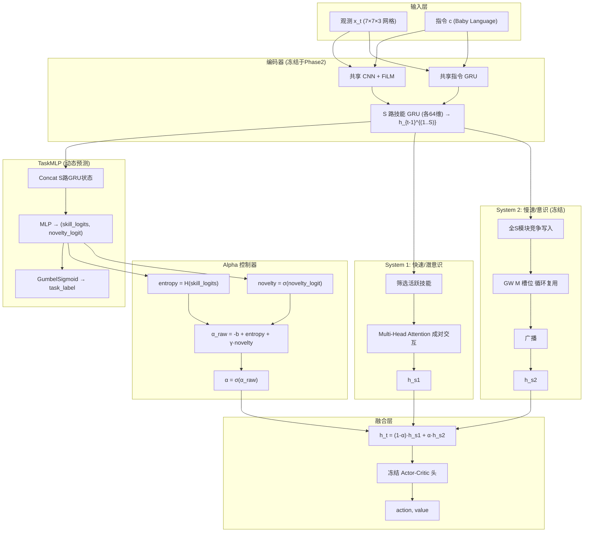

# DSNA (Dual-System Neural Architecture) 项目计划

> **核心思想**: 借鉴 Kahneman 的快慢系统理论，以**共享全局工作空间 (GW)** 为 System 2（慢速/审慎推理），**多任务模块化技能组合** 为 System 1（快速/直觉反应），在 **BabyAI 平台** 上进行多任务指令执行实验。随着任务经验的积累，知识从 System 2 逐渐 **内化/结晶** 到 System 1，由一个自适应 Alpha 门控机制动态决定两个系统的参与比例。

> **关键设计决策 (2026-07-19 确认)**:
> - S=8 个技能各有独立 GRU（64维），指令 GRU 共享；TaskMLP 拼接 S 路状态预测 `(skill_logits, novelty_logit)`
> - `α_raw = -b + entropy + γ·novelty`，GumbelSigmoid τ=1.0，无历史缓存
> - System 1: 活跃技能 Multi-Head Attention，Phase 2 可训练；System 2: N_iter=2 GW + 加权聚合
> - Phase 1: GW+Encoder+AC头 纯 PPO (8关) → 冻结；Phase 2: 仅训练 TaskMLP + S1注意力 + b/γ
> - AC 头 = Actor(h_t)→7 + Critic(h_t)→1 (两独立MLP)，Phase1 后冻结
> - Reptile 元学习: K_inner=5, Adam每任务重置(lr=0.01), ε_meta=0.1
> - Fast Head 每个 episode 重置为零；GW 记忆槽位跨关卡循环复用
> - 损失: Phase1 `L_ppo`；Phase2 `L_ppo + 0.1·ReLU(α_raw)`

---

## 1. 项目动机与理论背景

### 1.1 三篇基础论文

| 论文 | 角色 | 核心思想 |
|------|------|----------|
| **BabyAI** (Chevalier-Boisvert et al., ICLR 2019) | 实验平台 | 19 个难度递增的 2D 网格世界关卡，智能体需理解 Baby Language 指令并执行动作 |
| **Shared Global Workspace** (Goyal et al., ICLR 2022) | System 2 架构 | 专家模块通过竞争写入有限容量共享工作空间，广播协调，实现全局一致性 |
| **Polytropon** (Ponti et al., 2022) | System 1 架构 | 任务与潜在技能模块的软划分，LoRA/LT-SFT 参数高效适配，端到端学习技能分配 |

### 1.2 快慢系统类比

```
Kahneman 双系统理论              →   DSNA 架构映射
─────────────────────────────────────────────────
System 1: 快速、自动、直觉        →   模块化技能组合 (Polytropon)
  - 模式识别、习惯性反应            - 活跃技能模块间成对通信
  - 低认知负荷                      - 稀疏激活，参数高效
  - "潜意识"处理                    - pred_system1

System 2: 慢速、审慎、分析        →   共享全局工作空间 (GW)
  - 处理新奇/困难/冲突情境          - 所有模块通过工作空间全局协调
  - 高认知负荷                      - 全模块参与，带宽受限
  - "意识"处理                      - pred_system2

Alpha 门控 = 认知控制              →   α = σ(-b + H(skill_logits) + γ·novelty)
  - skill_logits → entropy              - 高熵→偏S2 (GW)
  - novelty_logit → σ → novelty          - novelty来自TaskMLP自身预测
```

---

## 2. 整体架构设计

### 2.1 系统总览



### 2.2 数据流公式

**Step 1: 编码 — S 路技能 GRU 各自维护隐藏状态**
```
# 共享编码
vision_feat = CNN_FiLM(x_t, c)           # CNN+FiLM 视觉+指令条件
instr_feat  = SharedInstrGRU(c)           # 共享指令编码

# S 路技能 GRU（每路 64 维，独立参数）
for i in 1..S:
    h_i^{(t)} = SkillGRU_i( concat(vision_feat, instr_feat),  h_i^{(t-1)} )
```
> 每路 GRU 独立维护对当前 episode 的时序记忆，不同技能关注观测的不同方面。

**Step 2: TaskMLP — 拼接 S 路状态，统一输出 skill_logits + novelty_logit**
```
h_concat      = concat(h_1^{(t-1)}, ..., h_S^{(t-1)})    # (B, S×64)
skill_logits  = SkillHead(MLP_shared(h_concat))           # (B, S)
novelty_logit = NoveltyHead(MLP_shared(h_concat))         # (B, 1)
task_label    = GumbelSigmoid(skill_logits)                # 训练时
task_label    = (skill_logits > 0).float()                 # 推理时
```

**Step 3: Alpha 计算**
```
entropy = -Σ_i [p_i·log(p_i) + (1-p_i)·log(1-p_i)],  p_i = σ(skill_logits_i)
novelty = σ(novelty_logit)                                   # TaskMLP 自身预测

α_raw = -b + entropy + γ · novelty                           # b,γ 可学习
α     = σ(α_raw)
```

**Step 4: System 1 — 活跃技能成对交互**
```
A    = {i | task_label_i > 0.5}                              # 活跃技能索引
h_s1 = MultiHeadAttention(
    Q = {W_q · h_i^{(t-1)} for i ∈ A},
    K = {W_k · h_i^{(t-1)} for i ∈ A},
    V = {W_v · h_i^{(t-1)} for i ∈ A}
)
h_s1 = Aggregate(h_s1)                                       # mean pooling
```

**Step 5: System 2 — GW 全局协调（冻结，仅前向）**

对齐原论文 Goyal et al. (2022) Section 2.1，做 **N_iter 次迭代写入 + S 路独立状态输出 + 可学习加权聚合**。

```
# 输入: S 路技能 GRU 状态 h_i^{(t-1)} (i=1..S, 各64维)
#       工作空间记忆 M_{t-1} (nm 槽位, 各64维)
# 超参: N_iter = 2~3 (写入迭代次数), top_k = 2 (每槽位选 k 个专家)

# === N_iter 次迭代写入 (蒸馏信息到 GW) ===
M_current = M_{t-1}
for iter in 1..N_iter:
    Q = M_current @ W_q                        # (nm, d)
    K = stack(h^{(1..S)}) @ W_k                # (S, d)
    V = stack(h^{(1..S)}) @ W_v                # (S, d)
    scores = Q @ K^T / √d                      # (nm, S)
    # Top-k 硬竞争
    selected = TopK_mask(scores, k=top_k)
    weights  = softmax(scores ⊙ selected)
    V_write  = weights @ V                     # (nm, d)
    # 门控更新 (RMC-style)
    gate = σ( W_gate · [M_current, V_write] )
    M_current = (1-gate) ⊙ M_current + gate ⊙ V_write

M_t = M_current  # 更新后的 GW 记忆

# === 广播: 所有 S 路专家从 GW 读取 → 各自独立更新 ===
for i in 1..S:
    q_i = h_i^{(t-1)} @ W_q'                             # (d,)
    K   = M_t @ W_k'                                      # (nm, d)
    V   = M_t @ W_v'                                      # (nm, d)
    attn_i = softmax(q_i @ K^T / √d)                      # (nm,)
    h_i' = h_i^{(t-1)} + attn_i @ V                       # 残差更新
    h_i' = LayerNorm(h_i')                                # 归一化

# === 可学习加权聚合 → h_s2 ===
w   = softmax( W_agg )                        # (S,) 可学习聚合权重 (Phase1训练，Phase2冻结)
h_s2 = Σ_{i=1..S} w_i · h_i'                  # (d,) 加权聚合为全局表征
```
> **与原论文对齐**: ① N_iter 次迭代写入（原论文: "apply attention multiple times to distill information"）；② S 路各自独立更新后保留状态（原论文: 每个专家单独做 dynamics）；③ 可学习聚合权重替代简单 mean pooling。

**Step 6: Alpha 融合 + 冻结 AC 头**
```
h_t    = (1 - α) · h_s1 + α · h_s2
action = FrozenAC_Actor(h_t)               # Phase1 训练后冻结，仅需 h_t
value  = FrozenAC_Critic(h_t)              # obs+instr 已编码在 h_t 中
```

**Step 7: 损失函数（Phase 2）**
```
L_total = L_PPO(action, reward, value) + λ_alpha · ReLU(α_raw)
#         ↑ 任务损失                       ↑ GW 使用惩罚
```

---

## 3. 与现有代码的有机整合

### 3.1 代码来源映射

| 组件 | 来源仓库 | 关键文件 | 修改方式 |
|------|----------|----------|----------|
| **BabyAI 环境** | `mila-iqia/babyai` | `babyai/levels/`, `babyai/model.py` | 直接复用，添加多任务包装器 |
| **BabyAI RL 训练** | `mila-iqia/babyai` | `babyai/rl/`, `scripts/train_rl.py` | 复用 PPO 算法核心，修改为多任务 |
| **技能模块** | 自设计 | S 路独立技能 GRU（各 64 维），**不需要 LoRA**——每路 GRU 自身就是技能特化的参数 |
| **任务-技能分配** | `McGill-NLP/polytropon` | `src/polytropon/polytropon.py::SkilledMixin` | 复用 IBP 先验和 GumbelSigmoid 概念，但技能模块改为独立 GRU |
| **全局工作空间** | 自实现（参考 GW 论文 Algorithm 1,2） | 新文件 | 全新实现，融合到 BabyAI 的 ACModel 中 |

### 3.2 BabyAI 模型扩展方案

BabyAI 原始 `ACModel` 结构：
```
观测(7×7×3) → CNN+FiLM ─┐
指令(text)   → GRU ─────┼─→ LSTM(记忆) → Actor/Critic MLP → action/value
```

扩展后的 `DSNAModel` 结构：
```
观测(7×7×3) → CNN+FiLM ─┐                         
指令(text)   → 共享GRU ──┼→ S路技能GRU ──┬→ System1: 活跃技能Pairwise → h_s1─┐
                                        ├→ System2: GW全局协调(冻结) → h_s2─┼→ α融合 → 冻结AC头
                   ┌─ TaskMLP(Concat) ←──┘                                     └→ loss
                   └→ (skill_logits, novelty_logit) → Alpha控制器
```
> **冻结组件（Phase2）**: Encoder (CNN+FiLM+共享GRU+技能GRU)、GW、Actor-Critic 头
> **可训练组件（Phase2）**: TaskMLP 的 slow_base + fast_head、b/γ（Alpha参数）

### 3.3 关键实现细节

#### 3.3.1 编码器: S 路技能 GRU

```python
class SkillEncoder(nn.Module):
    """
    S 路独立技能 GRU + 共享视觉/指令编码
    Phase 1 训练，Phase 2 冻结
    """
    def __init__(self, n_skills=8, skill_gru_dim=64, vision_dim=128, instr_dim=128):
        self.cnn_film = CNNWithFiLM(vision_dim)       # 共享 CNN+FiLM
        self.instr_gru = nn.GRU(instr_dim, instr_dim)  # 共享指令 GRU
        
        # S 路独立技能 GRU
        self.skill_grus = nn.ModuleList([
            nn.GRUCell(vision_dim + instr_dim, skill_gru_dim)
            for _ in range(n_skills)
        ])
        self.skill_h = None  # (S, B, 64) 当前隐藏状态
    
    def reset_episode(self):
        self.skill_h = torch.zeros(n_skills, batch_size, skill_gru_dim)
    
    def forward(self, x_t, instr):
        v_feat = self.cnn_film(x_t, instr)            # (B, vision_dim)
        i_feat = self.instr_gru(instr)                 # (B, instr_dim)
        combined = torch.cat([v_feat, i_feat], dim=-1) # (B, vision_dim+instr_dim)
        
        # 每路技能 GRU 独立更新
        new_h = []
        for i, gru in enumerate(self.skill_grus):
            h_i = gru(combined, self.skill_h[i])       # (B, 64)
            new_h.append(h_i)
        self.skill_h = torch.stack(new_h, dim=0)       # (S, B, 64)
        return self.skill_h                             # (S, B, 64)
```

#### 3.3.2 TaskMLP: 拼接S路状态，双输出

```python
class TaskMLP(nn.Module):
    """
    拼接 S 路技能 GRU 状态 → skill_logits + novelty_logit
    """
    def __init__(self, n_skills=8, skill_gru_dim=64, shared_dim=256):
        super().__init__()
        input_dim = n_skills * skill_gru_dim            # S × 64
        
        # 慢速基座 (跨任务共享，Reptile 元学习)
        self.slow_base = nn.Sequential(
            nn.Linear(input_dim, shared_dim),
            nn.LayerNorm(shared_dim),
            nn.ReLU(),
            nn.Linear(shared_dim, shared_dim),
            nn.ReLU(),
        )
        # 快速头部 (每 episode 重置)
        self.fast = nn.Sequential(
            nn.Linear(shared_dim, 64),
            nn.ReLU(),
        )
        self.skill_head  = nn.Linear(64, n_skills)
        self.novelty_head = nn.Linear(64, 1)
    
    def forward(self, skill_h):
        # skill_h: (S, B, 64)
        S, B, D = skill_h.shape
        h_concat = skill_h.permute(1, 0, 2).reshape(B, S*D)  # (B, S×64)
        
        f = self.slow_base(h_concat)
        f = self.fast(f)
        skill_logits  = self.skill_head(f)    # (B, S)
        novelty_logit = self.novelty_head(f)  # (B, 1)
        return skill_logits, novelty_logit
    
    def reset_fast_head(self):
        for layer in self.fast:
            if hasattr(layer, 'reset_parameters'):
                layer.reset_parameters()
        nn.init.zeros_(self.skill_head.weight)
        nn.init.zeros_(self.novelty_head.weight)
```

#### 3.3.3 Alpha 控制器 — 精简版

```python
class AlphaController(nn.Module):
    """
    α_raw = -b + entropy + γ·novelty
    - skill_logits → entropy
    - novelty_logit → σ → novelty (TaskMLP 自身预测，无历史缓存)
    - b, γ: 可学习参数
    """
    def __init__(self, b_init=1.5, gamma_init=1.0):
        super().__init__()
        self.b = nn.Parameter(torch.tensor(b_init))
        self.gamma = nn.Parameter(torch.tensor(gamma_init))
    
    def forward(self, skill_logits, novelty_logit):
        # entropy 来自 skill_logits
        probs = torch.sigmoid(skill_logits)
        entropy = -(probs * torch.log(probs + 1e-8) +
                    (1-probs) * torch.log(1-probs + 1e-8)).mean(dim=-1)  # (B,)
        
        # novelty 来自 TaskMLP 的 novelty_logit 输出
        novelty = torch.sigmoid(novelty_logit).squeeze(-1)              # (B,)
        
        alpha_raw = -self.b + entropy + self.gamma * novelty            # (B,)
        alpha = torch.sigmoid(alpha_raw)                                # (B,)
        return alpha, alpha_raw, entropy, novelty
```

#### 3.3.3 System 1: 活跃技能 Pairwise Attention

```python
class System1_PairwiseSkillComm(nn.Module):
    """
    对活跃技能的 GRU 状态做 Multi-Head Attention 成对交互。
    技能模块 = 技能 GRU 本身 (无需额外 LoRA)。
    注意力参数在 Phase2 中可训练。
    """
    def __init__(self, skill_dim=64, n_heads=4):
        super().__init__()
        self.attention = nn.MultiheadAttention(
            embed_dim=skill_dim, num_heads=n_heads, batch_first=False)
    
    def forward(self, skill_h, task_label):
        """
        skill_h:    (S, B, 64)  所有 S 路技能 GRU 的隐藏状态
        task_label: (B, S)      技能激活向量 (≈0/1)
        返回:       h_s1 (B, 64) 活跃技能成对交互后的聚合表征
        """
        S, B, D = skill_h.shape
        
        # 筛选活跃技能 (task_label > 0.5)
        active_mask = (task_label > 0.5).float().T.unsqueeze(-1)  # (S, B, 1)
        active_states = skill_h * active_mask                      # 非活跃置零
        
        # 只对活跃技能做 attention (用 mask)
        # key_padding_mask: True = 忽略该位置
        key_padding_mask = (task_label <= 0.5)                     # (B, S)
        
        h_s1, _ = self.attention(
            active_states, active_states, active_states,
            key_padding_mask=key_padding_mask
        )  # (S, B, D)
        
        # 仅活跃技能聚合
        active_count = active_mask.sum(dim=0).clamp(min=1)        # (B, 1)
        h_s1 = (h_s1 * active_mask).sum(dim=0) / active_count     # (B, D)
        
        return h_s1
```

#### 3.3.4 System 2: 全局工作空间 — 对齐原论文

```python
class System2_GlobalWorkspace(nn.Module):
    """
    对齐 Goyal et al. (2022) Section 2.1:
    - N_iter 次迭代写入 (原论文: "apply attention multiple times")
    - S 路独立状态输出 (原论文: 每个专家保持独立 trajectory)
    - 可学习加权聚合 → h_s2 (原论文无聚合，我们因下游 AC 头需要单向量而添加)
    - RMC 风格门控记忆更新
    """
    def __init__(self, n_specialists=8, specialist_dim=64, n_slots=4, 
                 top_k=2, n_write_iters=2):
        super().__init__()
        self.n_specialists = n_specialists
        self.n_slots = n_slots
        self.top_k = top_k
        self.n_write_iters = n_write_iters  # 写入迭代次数 (对齐原论文)
        
        D = specialist_dim
        
        # === 工作空间记忆槽位 ===
        self.memory_init = nn.Parameter(torch.randn(n_slots, D) * 0.02)
        self.register_buffer('memory', self.memory_init.clone())
        
        # === 写入: Q 来自记忆, K/V 来自专家 ===
        self.W_q_write = nn.Linear(D, D, bias=False)
        self.W_k_write = nn.Linear(D, D, bias=False)
        self.W_v_write = nn.Linear(D, D, bias=False)
        
        # === 广播读取: Q 来自专家, K/V 来自记忆 ===
        self.W_q_read = nn.Linear(D, D, bias=False)
        self.W_k_read = nn.Linear(D, D, bias=False)
        self.W_v_read = nn.Linear(D, D, bias=False)
        
        # === 门控更新 (RMC-style) ===
        self.gate = nn.Sequential(
            nn.Linear(2 * D, D),
            nn.Sigmoid()
        )
        self.layer_norm = nn.LayerNorm(D)
        
        # === 可学习聚合权重 (Phase1 训练，Phase2 冻结) ===
        self.agg_weight = nn.Parameter(torch.zeros(n_specialists))
        # softmax 归一化 → Σ w_i = 1
    
    def reset_episode(self):
        self.memory = self.memory_init.clone()
    
    def forward(self, specialist_states):
        """
        specialist_states: (S, B, D)  — S 路技能 GRU 的隐藏状态
        
        返回:
          h_s2:          (B, D)      — 加权聚合后的全局表征
          h_updated:     (S, B, D)   — S 路各自独立更新后的状态
          write_history: list        — 每次写入迭代后的 GW 状态 (可选，用于分析)
        """
        S, B, D = specialist_states.shape
        M = self.memory  # (n_slots, D)
        
        # ============================================================
        # Step 1: N_iter 次迭代写入 (对齐原论文 multi-step distillation)
        # ============================================================
        for _ in range(self.n_write_iters):
            Q = self.W_q_write(M)                          # (n_slots, D)
            K = self.W_k_write(specialist_states)           # (S, B, D)
            V = self.W_v_write(specialist_states)           # (S, B, D)
            
            # 竞争分数 (n_slots, S, B)
            scores = torch.einsum('nd,sbd->nsb', Q, K) / math.sqrt(D)
            
            # Top-k 硬竞争
            _, topk_idx = torch.topk(scores, self.top_k, dim=1)
            mask = torch.zeros_like(scores).scatter_(1, topk_idx, 1.0)
            weights = F.softmax(
                scores.masked_fill(mask == 0, -float('inf')), dim=1)
            
            # 写入值聚合: (n_slots, B, D)
            V_write = torch.einsum('nsb,sbd->nbd', weights, V)
            
            # RMC 门控更新
            M_exp = M.unsqueeze(1).expand(-1, B, -1)       # (n_slots, B, D)
            gate_val = self.gate(torch.cat([M_exp, V_write], dim=-1))
            M = (1 - gate_val) * M_exp + gate_val * V_write
        
        # 保存更新后的记忆（供下一 timestep）
        self.memory = M.mean(dim=1).detach() + (M - M.detach())
        
        # ============================================================
        # Step 2: 广播 — S 路各自独立读取 GW (对齐原论文独立 dynamics)
        # ============================================================
        Q_read = self.W_q_read(specialist_states)            # (S, B, D)
        K_read = self.W_k_read(M)                            # (n_slots, B, D)
        V_read = self.W_v_read(M)                            # (n_slots, B, D)
        
        # 每路专家与 GW 槽位的注意力: (S, n_slots, B)
        attn = F.softmax(
            torch.einsum('sbd,nbd->snb', Q_read, K_read) / math.sqrt(D), dim=1)
        broadcast_info = torch.einsum('snb,nbd->sbd', attn, V_read)
        
        # 残差更新 + LayerNorm → S 路独立状态
        h_updated = self.layer_norm(specialist_states + broadcast_info)  # (S, B, D)
        
        # ============================================================
        # Step 3: 可学习加权聚合 → h_s2
        # ============================================================
        w = F.softmax(self.agg_weight, dim=0)                # (S,)
        h_s2 = torch.einsum('s,sbd->bd', w, h_updated)       # (B, D)
        
        return h_s2, h_updated
```
> **与之前版本的差异**: ① `n_write_iters` 控制写入迭代次数（原论文默认 1，我们设 2~3）；② 返回 `h_updated (S,B,D)` S 路独立状态；③ `agg_weight` 可学习聚合替代 `mean(dim=0)`。

#### 3.3.5 Actor-Critic 头 + PPO 超参数

```python
class ActorCriticHead(nn.Module):
    """
    输入: h_t (B, 64) — 已编码 obs+instr 的融合表征
    输出: action_logits (B, 7), value (B, 1)
    两个独立 MLP，无共享层。
    Phase1 训练，Phase2 冻结。
    """
    def __init__(self, input_dim=64, n_actions=7, hidden=128):
        super().__init__()
        self.actor = nn.Sequential(
            nn.Linear(input_dim, hidden),
            nn.Tanh(),
            nn.Linear(hidden, n_actions)       # → 7 个动作 logits
        )
        self.critic = nn.Sequential(
            nn.Linear(input_dim, hidden),
            nn.Tanh(),
            nn.Linear(hidden, 1)               # → 状态价值
        )
    
    def forward(self, h):
        return self.actor(h), self.critic(h).squeeze(-1)
```

**PPO 超参数（沿用 BabyAI 原论文）**:

| 参数 | 值 | 说明 |
|------|-----|------|
| `clip_eps` | 0.2 | PPO clip 范围 |
| `γ` (discount) | 0.99 | 折扣因子 |
| `λ` (GAE) | 0.99 | GAE λ 参数 |
| `entropy_coef` | 0.01 | 策略熵系数 |
| `value_loss_coef` | 0.5 | 价值损失权重 |
| `max_grad_norm` | 0.5 | 梯度裁剪 |
| `lr` (Phase1) | 1e-4 | Adam 学习率 |
| `lr` (Phase2 outer) | 1e-4 | 外循环学习率 |
| `lr` (Phase2 inner) | 0.01 | Reptile 内循环学习率 (Adam 每任务重置) |
| `λ_alpha` | 0.1 | GW 使用惩罚权重 |
| `ε_meta` (Reptile) | 0.1 | Reptile 元步长 |
| `K_inner` | 5 | Reptile 内循环步数 |

**BabyAI 关卡集（8 关）**: GoToObj, GoToRedBallGrey, GoToRedBall, GoToLocal, PutNextLocal, PickupLoc, GoToObjMaze, GoTo

---

## 4. 项目目录结构

```
dsna_project/
├── README.md                       # 项目说明
├── requirements.txt                # 依赖
├── setup.py                        # 安装脚本
│
├── configs/                        # 配置文件
│   ├── default.yaml                # 默认配置
│   ├── experiment_1_babyai.yaml    # BabyAI 8关卡实验
│   └── experiment_2_scaling.yaml   # 技能数量/槽位数量缩放实验
│
├── src/
│   ├── __init__.py
│   │
│   ├── env/                        # === 环境层 (复用 BabyAI) ===
│   │   ├── __init__.py
│   │   ├── multitask_wrapper.py    # 多任务环境包装器
│   │   │                            #   - 统一 action/obs space
│   │   │                            #   - 任务采样策略 (均匀/课程)
│   │   │                            #   - 多进程并行
│   │   └── task_curriculum.py      # 课程学习调度器
│   │
│   ├── models/                     # === 模型层 ===
│   │   ├── __init__.py
│   │   ├── base_encoder.py         # CNN+FiLM+GRU+LSTM (来自 BabyAI ACModel)
│   │   ├── skill_encoder.py        # S路技能GRU编码器 (自实现，替代LoRA)
│   │   ├── task_mlp.py             # TaskMLP: task_id + h_prev → skill_logits
│   │   ├── alpha_controller.py     # Alpha 门控: entropy + novelty → α
│   │   ├── system1_pairwise.py     # System 1: 活跃技能 PairwiseAttention
│   │   ├── system2_workspace.py    # System 2: 共享全局工作空间
│   │   └── dsna_model.py          # DSNA 主模型 (组合以上)
│   │
│   ├── training/                   # === 训练层 ===
│   │   ├── __init__.py
│   │   ├── ppo_trainer.py          # PPO 训练器 (复用 BabyAI rl/ 核心)
│   │   ├── il_trainer.py           # 模仿学习训练器
│   │   ├── loss_functions.py       # 损失函数: L_task + L_IBP + L_alpha + L_ent
│   │   └── distillation.py         # System 2 → System 1 知识结晶
│   │
│   └── utils/                      # === 工具层 ===
│       ├── __init__.py
│       ├── metrics.py              # 日志/指标追踪 (success_rate, alpha_stats, ...)
│       ├── replay_buffer.py        # 经验回放
│       └── visualize.py            # 可视化 (任务-技能矩阵, alpha曲线, ...)
│
├── scripts/                        # 运行脚本
│   ├── train_dsna.py               # 主训练脚本
│   ├── evaluate_dsna.py            # 评估脚本
│   └── analyze_skills.py           # 技能分析脚本
│
├── experiments/                    # 实验记录
│   └── logs/                       # 训练日志
│
└── tests/                          # 单元测试
    ├── test_alpha_controller.py
    ├── test_system1.py
    ├── test_system2.py
    └── test_dsna_model.py
```

---

## 5. 训练流程

### 5.1 两阶段训练流程

#### 5.1.1 训练总览

```
Phase 1: GW 预训练 (纯 PPO，无 α 惩罚)
  ┌──────────────────────────────────────────┐
  │  Encoder + GW + Actor-Critic 头           │
  │  所有 BabyAI 关卡上 PPO 训练至收敛        │
  │  Loss = L_ppo                             │
  │  完成后 → 冻结 Encoder, GW, AC 头         │
  └──────────────────────────────────────────┘
                    ↓ 全部冻结
Phase 2: TaskMLP 元学习 (PPO + λ·ReLU(α_raw))
  ┌──────────────────────────────────────────┐
  │  仅训练: TaskMLP(slow_base+fast_head)     │
  │         + b, γ (Alpha 参数)               │
  │  冻结:  Encoder(含技能GRU), GW, AC头       │
  │  Loss = L_ppo + λ·ReLU(α_raw)             │
  │  Fast Head 每 episode 重置                │
  └──────────────────────────────────────────┘
```

#### 5.1.2 Phase 1: GW 预训练

```python
def pretrain_gw():
    """GW + Encoder + AC头 在所有关卡上 PPO 训练 → 全部冻结"""
    model = GWModel(
        encoder=SkillEncoder(n_skills=S, skill_gru_dim=64),
        gw=System2_GlobalWorkspace(n_specialists=S, n_slots=M),
        ac_head=ActorCriticHead()
    )
    
    for episode in range(N_pretrain):
        level = sample_level()
        h_skills = model.encoder(x_t, instr)    # (S, B, 64)
        h_s2, _ = model.gw(h_skills)            # GW处理 → h_s2 (B,64)
        action, value = model.ac_head(h_s2)      # Actor(h_s2)→7, Critic(h_s2)→1
        loss = ppo_loss(action, value, reward)   # PPO: clip=0.2, γ=0.99, λ=0.99
        loss.backward()
    
    # 全部冻结
    for p in model.parameters():
        p.requires_grad = False
    return model  # 作为冻结教师
```

#### 5.1.3 Phase 2: Reptile 元学习 TaskMLP

```python
def phase2_meta_training():
    # 加载冻结组件
    frozen = load_pretrained_gw().eval()        # Encoder, GW, AC头 全部冻结
    # skill GRU 状态由 frozen.encoder 输出，无需单独 skill_modules
    
    # 可训练组件: TaskMLP + S1注意力 + Alpha参数
    task_mlp = TaskMLP(n_skills=S, skill_gru_dim=64)
    system1  = System1_PairwiseSkillComm(skill_dim=64, n_heads=4)
    b     = nn.Parameter(torch.tensor(1.5))
    gamma = nn.Parameter(torch.tensor(1.0))
    opt   = Adam([*task_mlp.parameters(), *system1.parameters(), b, gamma], lr=1e-4)
    
    # Reptile 内循环优化器 (Adam，每任务重置状态)
    inner_opt = None  # 每任务重新创建
    
    for meta_iter in range(N_meta_iters):
        tasks = sample_tasks(batch_size=4)
        
        for task in tasks:
            # 保存 slow_base → Reptile 元更新用
            slow_params_init = task_mlp.get_slow_params_copy()
            
            # === 每个 episode 重置 Fast Head ===
            task_mlp.reset_fast_head()
            
            # === 内循环: K 步快速适配 ===
            for k in range(K_inner):
                batch = collect_episodes(task, n=2)
                
                for t in range(ep_len):
                    # S 路技能 GRU 前向 (冻结)
                    with torch.no_grad():
                        skill_h = frozen.encoder(batch.obs[t], batch.instr)  # (S,B,64)
                    
                    # TaskMLP 预测
                    skill_logits, novelty_logit = task_mlp(skill_h)
                    task_label = gumbel_sigmoid(skill_logits)
                    
                    # Alpha
                    entropy = compute_entropy(skill_logits)
                    novelty = torch.sigmoid(novelty_logit).squeeze(-1)
                    alpha_raw = -b + entropy + gamma * novelty
                    alpha = torch.sigmoid(alpha_raw)
                    
                    # System 1: 活跃技能 Pairwise Attention
                    active_mask = (task_label > 0.5)
                    h_s1 = pairwise_attention(skill_h, active_mask)
                    
                    # System 2: GW — N_iter 迭代写入 + S 路独立输出 + 加权聚合 (冻结)
                    with torch.no_grad():
                        h_s2, h_updated_s2 = frozen.gw(skill_h)
                        # h_s2:      (B, D)  加权聚合的全局表征
                        # h_updated: (S,B,D)  S 路独立更新状态
                    
                    # 融合 + AC 头 (权重冻结但梯度可穿过)
                    h_t = (1-alpha)*h_s1 + alpha*h_s2
                    action, value = frozen.ac_head(h_t)  # AC头仅需h_t，obs/instr已编码其中
                    
                    # === 唯一损失 ===
                    L = ppo_loss(action, value, batch.reward[t]) \
                        + lambda_alpha * F.relu(alpha_raw).mean()
                
                # 仅更新 fast_head (Adam，每任务重新初始化)
                if inner_opt is None or k == 0:
                    inner_opt = Adam(task_mlp.get_fast_params(), lr=0.01)
                inner_opt.zero_grad()
                L.backward()
                inner_opt.step()
            
            # === 外循环: Reptile 更新 slow_base ===
            for name, p in task_mlp.named_parameters():
                if 'slow_base' in name:
                    p.data += epsilon * (p.data - slow_params_init[name])
        
        # 日常端到端训练 (防遗忘)
        L_e2e = standard_forward(...)
        opt.zero_grad(); L_e2e.backward(); opt.step()
```

#### 5.1.4 学习动态

```
新 episode 开始 (Fast Head 刚重置):
  skill_logits ≈ 0 → entropy ≈ log(2)·S (最大)
  novelty_logit ≈ 0 → novelty ≈ 0.5
  α_raw ≈ -1.5 + high_entropy + 1.0×0.5 → > 0 → α ≈ 0.7
  → GW 主导，任务成功 → L_ppo 低
  → ReLU(α_raw) 惩罚推动 fast_head 学习
  → skill_logits 形成 → entropy↓, novelty_logit↓ → α↓

适配完成 (同 episode 后期):
  fast_head 适配当前情境 → entropy 低, novelty ≈ 0
  α ≈ 0.1~0.2 → S1 主导，GW 仅备用

意外情境 (同 episode 内):
  技能 GRU 状态变化 → TaskMLP 输出变化 → entropy↑/novelty↑
  → α 短暂升高 → GW 介入 → 解决后回落
```
        return skill_logits, novelty_logit
```

## 6. 实验设计

### 6.1 核心实验

| 实验 | 目的 | 对照组 |
|------|------|--------|
| **E1: GW 教师质量** | 验证 GW 预训练的效果 | GW 从头训练 vs GW 预训练后冻结 |
| **E2: 样本效率** | S1+Meta vs 纯 S1 vs 纯 GW | α=0(纯S1), α=1(纯GW), Shared/Private baseline |
| **E3: Alpha 消融** | 验证 α 公式各组件 | 无 entropy, 无 novelty, 固定 α, 可学习 vs 固定 b/γ |
| **E4: 技能数量** | 技能库存 `|S|` 的影响 | S = 2, 4, 8, 16, 32 |
| **E5: 元学习范式** | Reptile vs MAML vs 纯端到端 | Reptile(K=3,5,10), 无元学习(仅蒸馏), MAML 二阶 |
| **E6: 快速适应速度** | 新关卡加入后 α 下降曲线 | 测量 K 步内 α(t) 曲线, α 下降到 0.2 需要的步数 |
| **E7: 防记忆化验证** | 验证 slow_base 泛化 vs 死记 | 训练关卡 vs held-out 关卡的 α 下降速度对比 |
| **E8: GW 槽位数** | GW 带宽限制的影响 | M = 1, 2, 4, 8 |
| **E9: Fast Head 重置策略** | 零初始化 vs 噪声 vs 部分重置 | 不同 reset 方式对 α 恢复速度的影响 |

### 6.2 评价指标

- **Success Rate**: 每个关卡的任务成功率 (≥0.99 视为掌握)
- **α Adaptation Curve**: 新任务/新 episode 的 α(t) 下降曲线
- **Adaptation Steps K_99**: α 降到 0.2 以下所需的适配步数
- **Entropy/Novelty 分解**: 分别追踪 entropy(t) 和 novelty(t)
- **Skill Sparsity**: task_label 活跃技能占比
- **GW Usage Cost**: ReLU(α_raw) 均值
- **Meta-Generalization Gap**: 训练任务 vs held-out 任务的 α 下降速度差
- **Slow/Fast Weight Norm Ratio**: ∥fast_head∥ / ∥slow_base∥，衡量适配负担分布

---

## 7. 里程碑与时间线

| 阶段 | 周期 | 交付物 |
|------|------|--------|
| **M1: 基础框架** | 第 1-2 周 | BabyAI 多任务环境 + ACModel 基线跑通 |
| **M2: GW 预训练** | 第 3-4 周 | GW (N_iter=2, S路输出+加权聚合) + Encoder 全关卡 PPO 训练 → 冻结 |
| **M3: System 1 模块** | 第 5-6 周 | S1 Pairwise Attention (可训练) + AdaptiveTaskMLP (Fast/Slow) |
| **M4: Alpha + TaskMLP** | 第 7 周 | TaskMLP (Concat S路GRU+双输出) + Alpha 公式 + 纯 PPO loss |
| **M5: Reptile 元学习** | 第 8-9 周 | Reptile 训练循环 + Fast Head 每episode重置 + 元评估 |
| **M6: 实验** | 第 10-12 周 | α 下降曲线分析 + 防记忆化验证 + 消融实验 |
| **M7: 论文** | 第 13-16 周 | 论文写作 |

---

## 8. 设计决策确认 (2026-07-19)

| # | 问题 | 决策 |
|---|------|------|
| Q1 | 编码器结构 | **S 路独立技能 GRU**（各64维）+ 共享 CNN+FiLM + 共享指令 GRU。每路 GRU **即**技能模块（无需 LoRA） |
| Q2 | TaskMLP 输入 | **Concat S 路 GRU 状态** (S×64) → MLP → (skill_logits, novelty_logit) |
| Q3 | Alpha 公式 | `α_raw = -b + entropy + γ·novelty`。GumbelSigmoid 固定 τ=1.0 |
| Q4 | System 1 交互 | **活跃技能 Multi-Head Attention** 成对交互，注意力参数 **Phase2 可训练** |
| Q5 | 融合 + AC 头 | `h_t=(1-α)·h_s1+α·h_s2`。AC 头 = Actor(h_t)→7 + Critic(h_t)→1（两独立 MLP）。Phase1 后冻结 |
| Q6 | PPO 超参数 | 沿用 BabyAI: clip=0.2, γ=0.99, λ=0.99, ent_coef=0.01, lr=1e-4 |
| Q7 | 损失函数 | **Phase1**: `L_ppo`；**Phase2**: `L_ppo + λ_alpha·ReLU(α_raw)`, λ_alpha=0.1 |
| Q8 | Phase2 冻结/可训练 | **冻结**: Encoder、GW、AC 头。**可训练**: TaskMLP + S1注意力 + b/γ |
| Q9 | Reptile 优化器 | 内循环: **Adam 每任务重置** (lr=0.01)；外循环: Adam (lr=1e-4)；ε_meta=0.1 |
| Q10 | BabyAI 关卡 | **8 关**: GoToObj, GoToRedBallGrey, GoToRedBall, GoToLocal, PutNextLocal, PickupLoc, GoToObjMaze, GoTo |
| Q11 | GW 对齐原论文 | N_iter=2 迭代写入 + S 路独立状态 + 可学习加权聚合 + Top-k + RMC 门控 |
| Q12 | Phase1 GW 行为 | 所有 S 路技能 GRU 状态平等送入 GW，GW 通过竞争机制自行学习关注 |
| Q13 | GW 记忆复用 | 跨关卡循环复用，episode 间重置 |
| Q14 | 防记忆化 | Fast/Slow 双速 TaskMLP + Fast Head 每 episode 重置 + Reptile 元学习 Slow Base |
| Q15 | 元目标 | 最小化 K=5 步适配后的 α + 最大化适配后任务成功率 |

---

## 附录: 三篇论文代码关键文件速查

### BabyAI (`mila-iqia/babyai`)
```
babyai/model.py:82       → ACModel 类 (FiLM+GRU+LSTM 架构)
babyai/rl/               → PPO 算法实现
babyai/levels/iclr19_levels.py → 19 个关卡定义
babyai/bot.py            → 启发式 Bot 教师
babyai/imitation.py      → 模仿学习训练器
scripts/train_rl.py      → RL 训练入口
```

### Polytropon (`McGill-NLP/polytropon`)
```
src/polytropon/adapters.py:
  SkilledLoRALinear       → LoRA 技能适配器 (第114-171行)
  SkilledLTSFTLinear      → LT-SFT 稀疏适配器 (第177-238行)
  HyperLoRALinear         → HyperFormer 基线 (第34-94行)
src/polytropon/polytropon.py:
  SkilledMixin            → 主类: 技能混合 (第24-121行)
  neg_log_IBP()           → IBP 先验正则 (第86-106行)
src/polytropon/utils.py:
  replace_layers()        → 替换 Transformer 层为技能模块
  inform_layers()         → 设置当前活跃任务 ID
```

### Global Workspace (自实现，参考论文 Algorithm 1,2)
```
关键组件:
  - SharedWorkspace:   nm 个记忆槽位
  - WriteCompetition:  Top-k 或 Soft 竞争
  - BroadcastRead:     所有专家读取工作空间
  - GatedUpdate:       门控记忆更新
```

---

*计划版本: v0.1 | 日期: 2026-07-19 | 作者: DSNA Team*
